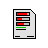

# QuickStatus

Quick status app for the 3DS: Battery, charging state, SDMC, NAND, Internet connection.

# Building
Build using [devkitpro3ds template](https://github.com/siljamdev/Tebas-Registry) for [Tebas](https://github.com/siljamdev/Tebas).  
Used latest devkitproArm, bannertool and makerom.  
